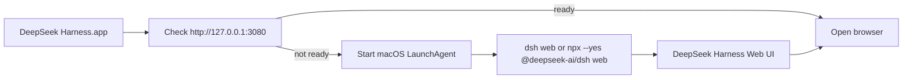

# DeepSeek Harness Web Launcher

A lightweight macOS launcher for the official DeepSeek Harness Web UI.

`dsh-web-launcher` starts and manages the official `dsh web` service with a macOS LaunchAgent, then opens the local Web UI at `http://127.0.0.1:3080`. It is intentionally small: no Electron shell, no bundled DeepSeek Harness runtime, no patched upstream files, and no model/API-key management.

> Independent community project. Not affiliated with, endorsed by, or sponsored by DeepSeek AI.

## Why This Exists

DeepSeek Harness is evolving quickly. Heavy desktop wrappers can lag behind upstream changes because they bundle runtime files, patch UI, or manage versions internally.

This launcher keeps the update path close to the official command:

```bash
npx --yes @deepseek-ai/dsh web
```

If you already have a global `dsh` command installed, the service uses:

```bash
dsh web
```

## Features

- One-click macOS app to open DeepSeek Harness Web.
- User-level LaunchAgent for background service management.
- Starts the official `dsh web` command without modifying DeepSeek Harness.
- Opens `http://127.0.0.1:3080` when the service is ready.
- Works with `nvm` Node.js environments.
- Uses `dsh` when available, otherwise falls back to `npx --yes @deepseek-ai/dsh web`.
- Keeps logs in a predictable local folder.
- Easy uninstall script for removing the LaunchAgent.

## Keywords

DeepSeek Harness launcher, DSH launcher, dsh web launcher, DeepSeek Harness desktop launcher, macOS LaunchAgent, local AI agent, `npx @deepseek-ai/dsh web`, `127.0.0.1:3080`, lightweight DeepSeek Harness desktop, no Electron wrapper.

## Requirements

- macOS
- Node.js with `npx`, or a global `dsh` command
- Internet access on the first `npx` run

## Install

1. Download or clone this repository.
2. Double-click:

   ```text
   scripts/install-service.command
   ```

3. Wait for the first startup. The first `npx` run can take several minutes.
4. Double-click:

   ```text
   DeepSeek Harness.app
   ```

The launcher opens:

```text
http://127.0.0.1:3080
```

## Daily Use

After installation, double-click `DeepSeek Harness.app`.

The app checks whether DeepSeek Harness Web is already reachable. If not, it starts the LaunchAgent and waits for the local service before opening the browser.

## Logs

Service logs are written to:

```text
~/Library/Application Support/DeepSeek Harness Web/logs/dsh-web.log
```

LaunchAgent stdout/stderr logs are written to:

```text
~/Library/Application Support/DeepSeek Harness Web/logs/launchd.out.log
~/Library/Application Support/DeepSeek Harness Web/logs/launchd.err.log
```

## Uninstall

Double-click:

```text
scripts/uninstall-service.command
```

This removes the macOS LaunchAgent. It does not delete logs or local support files.

To remove logs manually, delete:

```text
~/Library/Application Support/DeepSeek Harness Web
```

## What This Project Does Not Do

- Does not bundle DeepSeek Harness.
- Does not patch DeepSeek Harness source code.
- Does not manage model providers, API keys, sessions, workspaces, plugins, or skills.
- Does not expose the local service to the LAN.
- Does not replace the official DeepSeek Harness CLI.

## How It Works



## Troubleshooting

### The browser opens but shows connection refused

The local service is not ready yet. Check:

```text
~/Library/Application Support/DeepSeek Harness Web/logs/dsh-web.log
```

Look for a line like:

```text
dsh web: http://127.0.0.1:3080
```

### First launch looks slow

The first `npx --yes @deepseek-ai/dsh web` run may download and prepare the official package. This can take several minutes depending on network and npm cache state.

### Node.js is installed with nvm but the service cannot find npx

The service script loads:

```text
~/.nvm/nvm.sh
```

It also scans:

```text
~/.nvm/versions/node/*/bin
```

If it still fails, open the log file and confirm whether `npx` appears in `PATH`.

## 中文说明

这是一个轻量级 macOS 启动器，用来启动官方 DeepSeek Harness Web UI。

它不会打包 DeepSeek Harness，也不会修改官方源码；只是用 macOS 用户级 LaunchAgent 在后台运行官方命令：

```bash
npx --yes @deepseek-ai/dsh web
```

如果本机已有全局 `dsh` 命令，则优先运行：

```bash
dsh web
```

适合只想“点一下打开 DeepSeek Harness”，但不想使用完整桌面壳或固定内置版本的用户。

## Related

- Official DeepSeek Harness repository: <https://github.com/deepseek-ai/deepseek-harness>
- Official startup command: `npx @deepseek-ai/dsh web`

## License

MIT

DeepSeek, DeepSeek Harness, and related marks belong to their respective owners.
